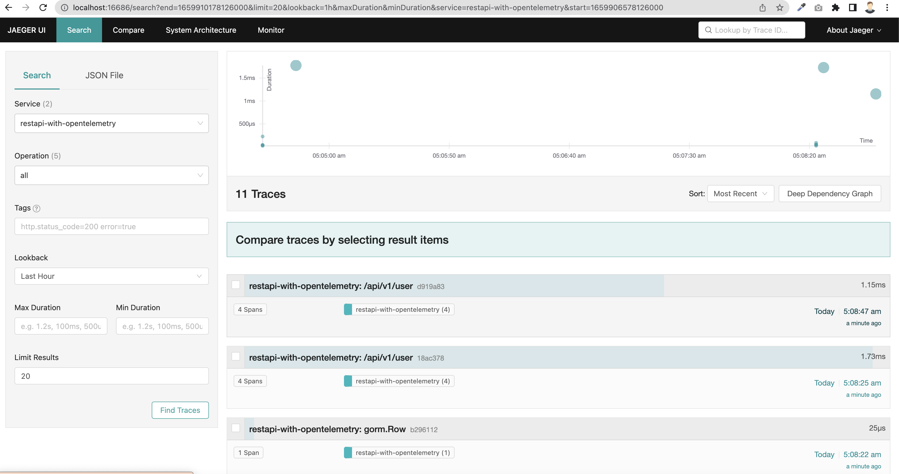
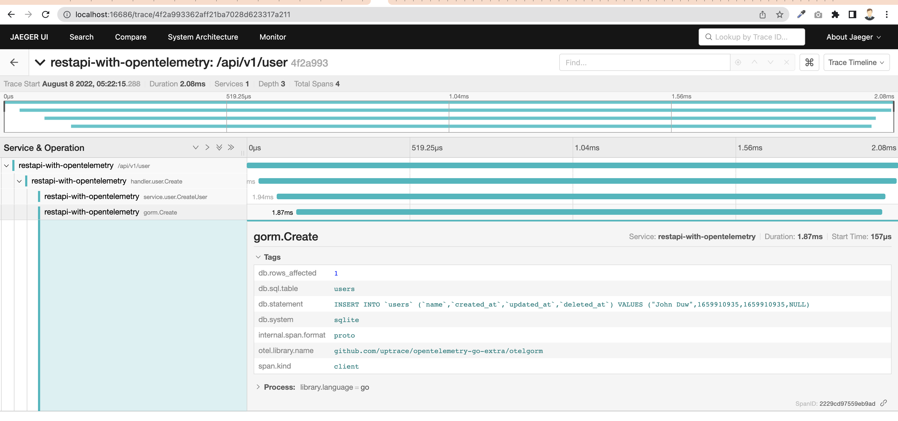
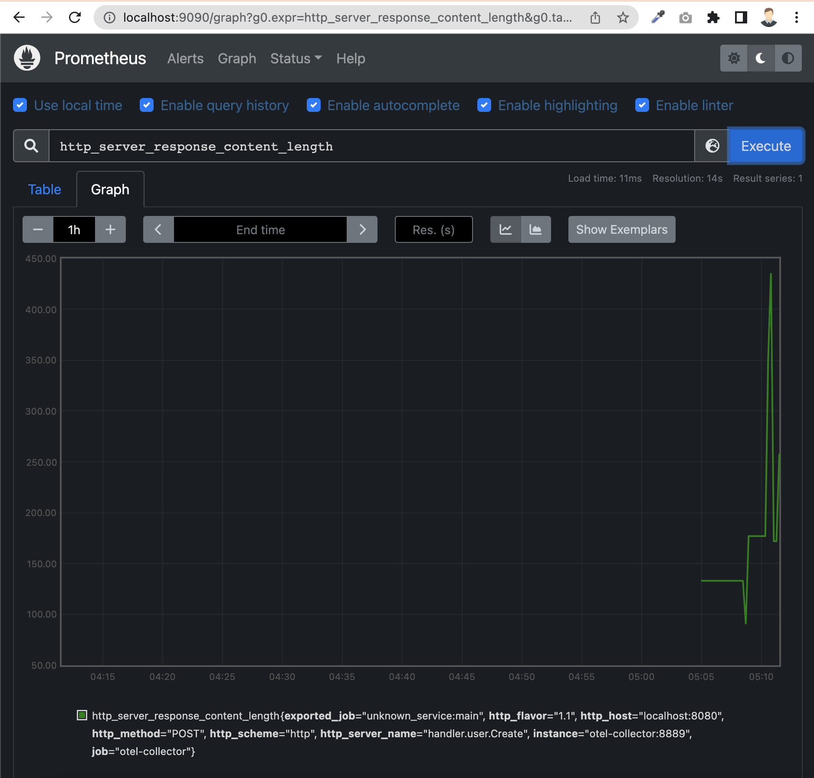

# restapi-with-opentelemetry
This example illustrates how to export trace and metric data from the OpenTelemetry SDK to the OpenTelemetry Collector (otel-collector) with otlp. From there, we bring the trace data to Jaeger and the metric data to Prometheus The complete flow is:
```
                                          -----> Jaeger (trace)
App + SDK ---> OpenTelemetry Collector ---|
                                          -----> Prometheus (metrics) --> Grafana (Visualization)
```
- [Installation](#installation)
- [Usage](#usage)

## Installation

### Requirements

1. [Go](https://golang.org/doc/install) 1.16+
2. [Docker](https://docs.docker.com/engine/install/) for database testing with [testcontainer](https://www.testcontainers.org/)

### Setting up environment

For a starter, export env `env.example` to your os env / docker env

## Getting Started
## Usage

### Development
Run **otel-collector**, **Promotheus**, **Jaeger** service with docker-compose:
```
docker-compose -f deploy/docker-compose/docker-compose.yaml up
```

##### Run restapi server:
```
 go mod tidy
```

After all installed properly, start the development.

```
 go run cmd/server/main.go
```

#### Make requests:
HTTP/1.1 POST API with curl
```
$ curl \
--header "Content-Type: application/json" \
--data '{"name": "John"}' \
http://localhost:8080/api/v1/user
```

reponse:
```
{
    "error": false,
    "message": "OK",
    "data": {
        "id": 1,
        "name": "John",
        "created_at": 1659910127
    }
}
```

### Viewing instrumentation data
#### Jaeger UI
open in your browser: ```http://localhost:16686``` then select service and find traces. 





#### Prometheus UI
```http://localhost:9090```



### Make test:
```
make test
```
or
```
go test ./...
```


### Todo:
- [ ] Create grafana server and add prometheus visualization
- [ ] Add log agent, log aggregator like ELK, because currently open-telemtry-go sdk doesn't support logging yet.
- [ ] moreee :D
